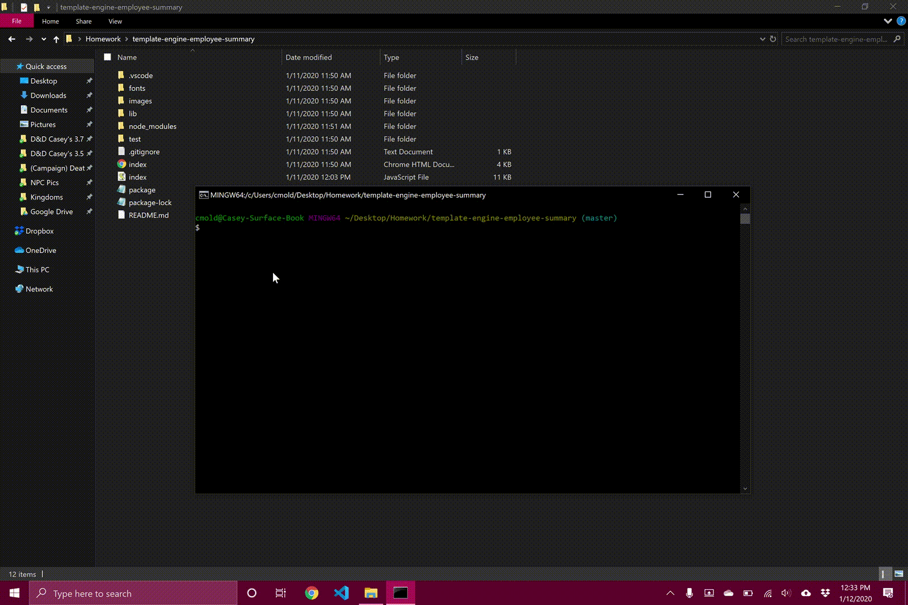

# template-engine-employee-summary

In this app, The user uses the terminal (node index.js) and is given variuous prompts to build a team, inserting team members with bits of information based on the prompts.

​
## Getting Started

Steps:
1) Open terminal at file location
2) type node index.js to run and follow the given prompts
3) once satisfied, the user may choose to stop adding members and this will generate the HTML file output.html
4) user may open this file in the browser to view their team/crew. 
5) remove the rebel alliance from the universe

Started writing the app like any other, creating the needed files and folders: index.js and index.html ​(for testing the html and css generated by the app). I put a lot of time into the styling initially, but later returned to it and completely changed it up (as always). originally it looked as the image in the readme of the project:

Sadly i did not take any images of the dramatic change as i quickly changed it back to a more simple design which is the current. I'm...very particular with my styling. After this i directed my attention to the test (done with jest). Initially i was writing them myself and spent...quite a long time on them before i learned that these tests were already provided by the instructor of the program. So then i worked on those for a bit longer before getting them to run perfectly. Probably put in about 20 hours overall.

its beautiful to look at!

Then i began powering through in the index.js starting with the prompts and inserting the HTML to be generated by a function (copied from my index.html file). After i finished the prompts i greatly struggled through organizing my code, constantly reworking through it and changing it. The prompts alone i must have changed through 5 different versions. And of course, like an idiot perfectionist nerd, i decided the day the project is due to go through everything and restructure the theme of my project from employees (manager, Engineer and Intern) into star Wars Empire theme (Captains, Stormtroopers and Pilots)...may add more laterr like Admirals or Techs of some kind...something Starwars-ish. Anyways, this was a follish decision because i wasn't even done with the functionality of the project when i made this drastic change in style but luckily it turned out okay in the end and finished just in time to submit the project.

After the reworking of the theme i finished up on the functionality of the code so that it could account for member/crew information and append it to the html before generating it as a file. This took an insane amount of time, research and effort but learned a great deal. I've very happy with the final result.

Here is a demo of the process as i did not commit a live version.

## Built With
​
* [HTML](https://developer.mozilla.org/en-US/docs/Web/HTML)
* [CSS](https://developer.mozilla.org/en-US/docs/Web/CSS)
* [Javascript](https://developer.mozilla.org/en-US/docs/Web/JavaScript)
​
​
## Authors
​
* **Casey Moldavon** 
​
- [Link to Portfolio Site](https://casey-moldavon.github.io/updated-portfolio-page/)
- [Link to Github](https://github.com/casey-moldavon/template-engine-employee-summary)
- [Link to LinkedIn](https://www.linkedin.com/in/casey-moldavon-442a1761/)
​
See also the list of [contributors](https://github.com/your/project/contributors) who participated in this project.
​
## License
​
This project is licensed under the MIT License 
​
## Acknowledgments
​
* Big thanks to Christopher Melby and Andres Felipe Jimenez whom both helped me out a great deal and also HUGE thank you to Yali Miranda. He developed the Sandwich method. though i didn't use it, his method helped me a great deal.